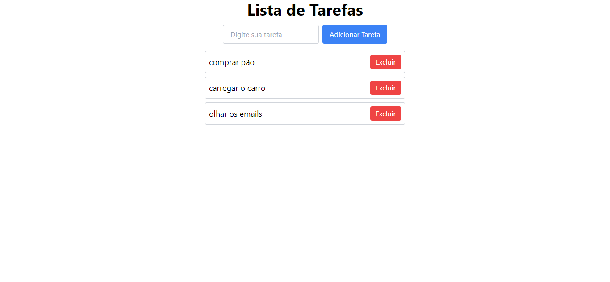

# Lista de Tarefas

Este código cria uma aplicação simples de lista de tarefas usando jQuery e Tailwind CSS. A aplicação permite adicionar e remover tarefas.

## Funcionalidades

- **Adicionar Tarefa:** Permite ao usuário adicionar uma nova tarefa à lista.
- **Excluir Tarefa:** Permite ao usuário remover tarefas da lista.

## Como Usar

1. **Adicionar Tarefa:**
   - Digite a tarefa no campo de entrada.
   - Clique no botão "Adicionar Tarefa" para adicionar a tarefa à lista.

2. **Excluir Tarefa:**
   - Clique no botão "Excluir" ao lado da tarefa para removê-la da lista.

## Imagem

